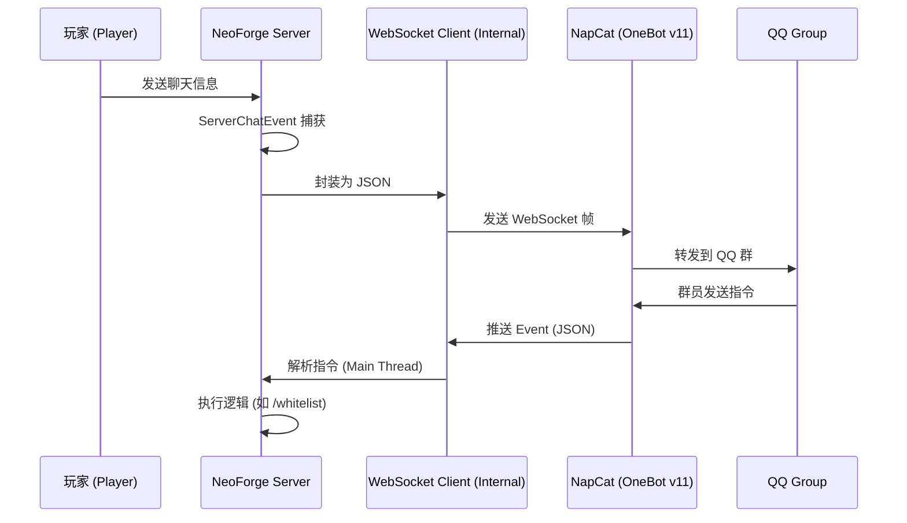

# MapBot Reforged - 系统架构设计文档 (System Architecture)

## 1. 技术选型 (Tech Stack)
* **游戏核心**: Minecraft NeoForge 1.21.1
* **开发语言**: Java 21 (JDK 21)
* **通信协议**: WebSocket (RFC 6455)
* **Bot 实现**: NapCat (基于 OneBot v11 标准)
* **数据存储**: SQLite (轻量级) 或 JSON (配置文件)

## 2. 核心架构模式 (Microservices Pattern)
本项目采用 **彻底解耦** 的设计，游戏服务器不直接登录 QQ，而是通过 WebSocket 连接外部 Bot 程序。

### 数据流向图

## 3. 模块划分
* **BotClient**: 负责维护 WebSocket 长连接，处理断线重连。
* **GameListener**: 注册 NeoForge EventBus，监听 ServerChatEvent, PlayerLoggedInEvent。
* **CommandHandler**: 解析来自 QQ 的指令并调度到游戏主线程执行。
