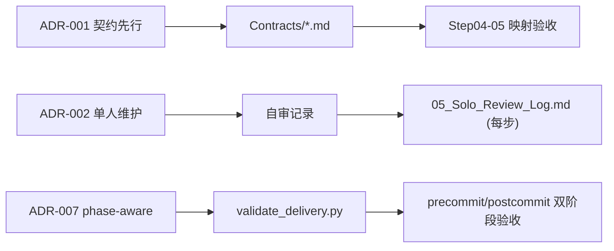

# 02_ADR_Consolidation_Plan — ADR 沉淀与决策追踪

## 文档元数据
| 字段 | 值 |
|---|---|
| DocID | ADR-CONSOL-J1-001 |
| Version | 1.0.0 |
| Owner | Solo Maintainer |
| Last Updated | 2026-02-16 |

## 1. ADR 列表

| ADR-ID | 决策标题 | 产生阶段 | 状态 | 实现证据 |
|---|---|---|---|---|
| ADR-001 | 契约先行: 合同冻结后再改代码 | A1 | ✅ 有效 | SYSTEM_REFACTOR_DEVELOPMENT_TASKLIST.md §2 |
| ADR-002 | 单人维护模式: 自审+自记录 替代多人评审 | A1 | ✅ 有效 | SYSTEM_REFACTOR_DEVELOPMENT_TASKLIST.md §2.1 |
| ADR-003 | Bridge 协议版本协商 (protocol_version) | D1 | ✅ 有效 | Step08 Artifacts |
| ADR-004 | 幂等键去重缓存 (TTL+冲突语义) | D1 | ✅ 有效 | Step08 Artifacts |
| ADR-005 | 网络线程只读快照 | D2 | ✅ 有效 | Step09 Artifacts |
| ADR-006 | CAS 版本化写入 | D3 | ✅ 有效 | Step10 Artifacts |
| ADR-007 | validate_delivery.py phase-aware 校验 | I1 | ✅ 有效 | Step20 Evidence, README §9-10 |
| ADR-008 | MIT 许可证选择 | I2 | ✅ 有效 | /LICENSE |
| ADR-009 | Contributor Covenant 2.1 行为准则 | I2 | ✅ 有效 | /CODE_OF_CONDUCT.md |
| ADR-010 | CONDITIONAL PASS 准入策略 | 全程 | ⚠️ 待审 | 189 差距积累, 需评估是否过宽 |

## 2. 决策 → 实现 → 证据链路

## 3. 状态管理

| 状态 | 定义 | 后续动作 |
|---|---|---|
| ✅ 有效 | 决策仍然适用, 实现与决策一致 | 定期复审 |
| ⚠️ 待审 | 决策可能需要调整 | J2 评估并决定保留/修改/废弃 |
| ❌ 废弃 | 决策已被替代 | 标注替代 ADR 编号 |

## 4. 后续行动
1. ADR-010 需在 J2 评估: CONDITIONAL PASS 门槛是否需要收紧
2. 建立 ADR 变更触发条件: 架构重大变更 / 事故复盘 / 版本迁移
3. ADR 归档至 `Project_Docs/DECISIONS/` 目录
