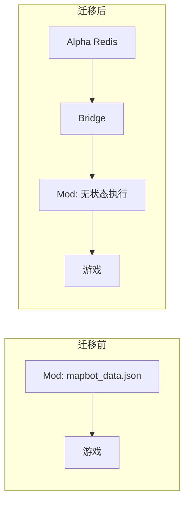

# MapBot Reforged 项目接续报告 v1.0
> 生成时间: 2026-01-26 19:24  
> 版本: v5.5.0 → v5.6.0 (Task #022 完成后)

---

## 一、项目概述

MapBot Reforged 是一个 QQ 群 ↔ Minecraft 服务器双向互通的机器人系统，由两个主要组件构成：

| 组件 | 目录 | 技术栈 | 职责 |
|------|------|--------|------|
| **Alpha Core** | `Mapbot-Alpha-V1/` | Java 独立应用 + Netty + Redis | QQ 协议对接、命令处理、数据存储、多服调度 |
| **Reforged Mod** | `MapBot_Reforged/` | NeoForge 1.21.1 Mod | 游戏逻辑执行、事件上报、物品发放 |

**通信链路**:
```
QQ群 ←WebSocket→ NapCat ←WebSocket→ Alpha ←TCP Bridge→ Reforged Mod
```

---

## 二、当前已完成功能

### 2.1 核心功能
- [x] QQ ↔ MC 双向聊天 (含 @提及)
- [x] Level 0-2 权限系统
- [x] 禁言拦截系统
- [x] 高级签到系统 (Tag 随机奖池 + CDK)
- [x] **Task #022: Redis 跨服签到迁移** ✅

### 2.2 已修复的 Bug (P0-P3)
| 优先级 | 问题 | 修复 |
|--------|------|------|
| P0 | `SignManager.claimOnline` 物品丢失 | 失败时放回 pendingRewards |
| P0 | `DataManager.bind` UUID 无唯一性检查 | 添加 `isUUIDBound()` |
| P1 | `handleAcceptReward` 响应太简略 | 区分离线/无奖励/背包满情况 |
| P3 | 签到格式不符合用户要求 | 实现新格式 (玩家名+累计天数+在线检测) |

---

## 三、Alpha Core 架构

### 3.1 命令系统

**入口**: `CommandRegistry.dispatch(cmdName, args, senderQQ, sourceGroupId)`

**已注册命令** (21个):
```
签到系统: #sign, #accept, #cdk
绑定系统: #id/#bind, #unbind, #forceunbind
查询系统: #list, #status, #loc, #inv, #time
权限系统: #myperm, #setperm, #addadmin, #removeadmin
管理系统: #mute, #unmute, #stop, #cancelstop, #reload
其他:     #help
```

**权限等级**:
- Level 0: 默认用户
- Level 1: 受信用户 (部分查询)
- Level 2: 管理员 (管理命令)

### 3.2 Bridge 接口 (Alpha → Mod)

| 方法 | action | 用途 |
|------|--------|------|
| `getOnlinePlayerList()` | get_players | 获取在线玩家 |
| `getServerStatus()` | get_status | 获取服务器状态 |
| `resolveAndBind()` | bind_player | 解析并绑定玩家 |
| `getPlayerInventory()` | get_inventory | 获取玩家背包 |
| `getPlayerLocation()` | get_location | 获取玩家位置 |
| `executeCommand()` | execute_command | 执行游戏命令 |
| `broadcast()` | broadcast | 广播消息 |
| `getPlaytime()` | get_playtime | 获取在线时长 |
| `stopServer()` | stop_server | 关闭服务器 |
| `cancelStop()` | cancel_stop | 取消关服 |
| **`rollLoot()`** | roll_loot | 请求抽奖 (Task #022) |
| **`giveItem()`** | give_item | 发放物品 (Task #022) |
| **`redeemCdk()`** | - | CDK 验证 (Alpha 本地) |

### 3.3 Redis Key 设计 (Task #022)

```
mapbot:sign:last:<qq>      → yyyy-MM-dd (最后签到日期)
mapbot:sign:days:<qq>      → int (累计签到天数)
mapbot:sign:pending:<qq>   → JSON (待领取物品, 24h过期)
mapbot:cdk:<code>          → JSON (CDK信息, 24h过期)
mapbot:bindings            → Hash (QQ→UUID绑定)
mapbot:permissions         → Hash (QQ→权限等级)
```

---

## 四、Reforged Mod 架构

### 4.1 Bridge 消息类型处理器

| type | 处理器 | 用途 |
|------|--------|------|
| register_ack | - | 注册确认 |
| heartbeat_ack | - | 心跳确认 |
| proxy_response | handleProxyResponseFromAlpha | 代理响应 |
| command | handleCommand | 执行命令 |
| qq_message | handleQQMessage | QQ消息转游戏 |
| get_players | handleGetPlayers | 获取玩家列表 |
| get_status | handleGetStatus | 获取状态 |
| bind_player | handleBindPlayer | 绑定玩家 |
| sign_in | handleSignIn | 签到 (旧版) |
| accept_reward | handleAcceptReward | 领取奖励 (旧版) |
| get_inventory | handleGetInventory | 获取背包 |
| get_location | handleGetLocation | 获取位置 |
| execute_command | handleExecuteCommand | 执行命令 |
| broadcast | handleBroadcast | 广播 |
| get_playtime | handleGetPlaytime | 获取时长 |
| get_cdk | handleGetCdk | 获取CDK (旧版) |
| stop_server | handleStopServer | 关服 |
| cancel_stop | handleCancelStop | 取消关服 |
| **roll_loot** | handleRollLoot | 抽奖 (Task #022) |
| **give_item** | handleGiveItem | 发物品 (Task #022) |

### 4.2 游戏内命令

```
/mapbot cdk <code>  - 兑换签到奖励 CDK
```

---

## 五、签到流程图 (Task #022 后)

```
#sign 签到流程:
┌────────┐     ┌────────┐     ┌────────┐     ┌────────┐
│ QQ 群  │────▶│ Alpha  │────▶│ Redis  │     │  Mod   │
└────────┘     └────────┘     └────────┘     └────────┘
     │              │              │              │
     │  #sign       │              │              │
     │─────────────▶│ 检查签到     │              │
     │              │─────────────▶│              │
     │              │◀─────────────│              │
     │              │              │              │
     │              │ roll_loot    │              │
     │              │─────────────────────────────▶│
     │              │◀─────────────────────────────│ Item JSON
     │              │              │              │
     │              │ 存 pending   │              │
     │              │─────────────▶│              │
     │              │              │              │
     │◀─────────────│ 回复签到结果  │              │
     │              │              │              │

#accept 领取流程 (在线):
     │  #accept     │              │              │
     │─────────────▶│ 获取 pending │              │
     │              │─────────────▶│              │
     │              │◀─────────────│              │
     │              │              │              │
     │              │ give_item    │              │
     │              │─────────────────────────────▶│ 发放物品
     │              │◀─────────────────────────────│ SUCCESS
     │              │              │              │
     │              │ 删 pending   │              │
     │              │─────────────▶│              │
     │◀─────────────│ 领取成功     │              │
```

---

## 六、关键文件索引

### Alpha Core
```
src/main/java/com/mapbot/alpha/
├── MapbotAlpha.java              # 主入口
├── bridge/
│   ├── BridgeServer.java         # TCP 服务端
│   ├── BridgeMessageHandler.java # 消息处理
│   ├── BridgeProxy.java          # 代理接口 ★
│   └── ServerRegistry.java       # 多服注册
├── command/
│   ├── CommandRegistry.java      # 命令注册中心 ★
│   ├── ICommand.java             # 命令接口
│   └── impl/                     # 21 个命令实现
├── config/
│   └── AlphaConfig.java          # 配置管理
├── data/
│   └── DataManager.java          # 数据管理 (绑定/权限) ★
├── database/
│   └── RedisManager.java         # Redis 连接池
├── logic/
│   └── SignManager.java          # 签到管理 (Redis版) ★
└── network/
    ├── OneBotClient.java         # QQ 协议客户端
    └── LogWebSocketHandler.java  # 日志推送
```

### Reforged Mod
```
src/main/java/com/mapbot/
├── MapBot.java                   # Mod 入口 ★ (/mapbot cdk)
├── config/
│   └── BotConfig.java            # 配置
├── data/
│   ├── DataManager.java          # 本地数据 (累计签到天数等)
│   └── loot/
│       └── LootConfig.java       # 奖池配置
├── logic/
│   ├── SignManager.java          # 签到逻辑 (本地版, 部分废弃)
│   ├── InventoryManager.java     # 背包管理
│   ├── GameEventListener.java    # 游戏事件
│   └── ServerStatusManager.java  # 状态管理
└── network/
    ├── BotClient.java            # QQ WebSocket
    └── BridgeClient.java         # Alpha TCP 客户端 ★
```

## 七、权限系统详解

### 7.1 双轨权限体系

系统采用 **权限等级 (Level)** + **管理员标记 (Admin)** 双轨制：

| 权限 | 等级值 | 说明 | 可用命令示例 |
|------|--------|------|-------------|
| **普通用户** | Level 0 | 默认权限 | `#sign`, `#bind`, `#list`, `#help` |
| **受信用户** | Level 1 | 可查询他人信息 | `#loc`, `#inv`, `#time` |
| **管理员** | Level 2 | 可执行管理命令 | `#mute`, `#unmute`, `#setperm` |
| **超级管理员** | Admin 标记 | 最高权限 | `#stop`, `#reload`, `#addadmin`, `#forceunbind` |

### 7.2 权限管理命令

```bash
# 查看自己权限
#myperm

# 设置用户权限等级 (需 Admin)
#setperm @QQ用户 <0|1|2>

# 添加管理员 (需 Admin)
#addadmin @QQ用户

# 移除管理员 (需 Admin)
#removeadmin @QQ用户
```

### 7.3 权限数据存储

**本地存储**: `config/permissions.json`, `config/admins.json`  
**Redis 存储** (启用时):
```
mapbot:permissions   → Hash (QQ号 → Level)
mapbot:admins        → Set (管理员QQ号列表)
```

### 7.4 初始管理员配置

在 `config/alpha.properties` 中设置：
```properties
messaging.adminQQs=123456789,987654321
```
逗号分隔多个 QQ 号，启动时自动同步到管理员列表。

---

## 八、Dashboard 面板使用

### 8.1 面板概述

Dashboard 是一个基于 **纯 HTML + JavaScript** 的 Web 管理面板，内置于 Alpha Core。

> [!IMPORTANT]
> 原有的 Vue 3 + TypeScript 页面由于 CSS 失效已被弃用。目前使用的是稳定的 HTML 原生版本。

**访问地址**: `http://<AlphaIP>:25560/`  
**默认凭证**: 首次启动时在控制台输出

### 8.2 页面功能

| 页面 | 路由 | 功能 |
|------|------|------|
| **Dashboard** | `/` | 服务器概览、实时日志 |
| **Servers** | `/servers` | 多服状态监控、TPS/内存/玩家数 |
| **Console** | `/console` | 实时日志流、命令执行 (含多服切换) |
| **Files** | `/files` | 远程文件管理 (查看/编辑/删除) |
| **Settings** | `/settings` | 配置管理 (已实现并投入使用) |
| **Login** | `/login` | 登录页面 |

### 8.3 实时监控

Dashboard 页面通过 WebSocket 连接获取实时数据：
```
ws://<AlphaIP>:25560/ws
```
自动推送：
- MC 服务器事件日志
- 玩家上下线
- 命令执行结果

### 8.4 服务器状态卡片

显示当前连接的所有 MC 服务器：
- **Server ID**: 服务器标识
- **Players**: 在线玩家数
- **TPS**: 实时 TPS (绿色≥18, 黄色<18)
- **Memory**: 内存使用

### 8.5 文件管理

支持远程操作 MC 服务器文件：
- 浏览目录结构
- 查看/编辑配置文件
- 删除文件 (需确认)

**安全**: 操作通过 Alpha-Mod Bridge 代理，无法访问 Alpha 本机文件。

---

## 九、配置文件说明

### 9.1 Alpha Core 配置 (`config/alpha.properties`)

```properties
# NapCat WebSocket 地址
connection.wsUrl=ws://127.0.0.1:7000

# 重连间隔 (秒)
connection.reconnectInterval=5

# Redis 配置
redis.enabled=true
redis.host=127.0.0.1
redis.port=6379
redis.password=
redis.database=0

# QQ 群配置
messaging.playerGroupId=875585697      # 玩家群
messaging.adminGroupId=885810515       # 管理群
messaging.botQQ=2133782376             # 机器人QQ

# 初始管理员 (逗号分隔)
messaging.adminQQs=123456789

# 调试模式
debug.debugMode=true
```

### 9.2 Reforged Mod 配置 (`config/mapbot.toml`)

```toml
[connection]
alphaHost = "127.0.0.1"
alphaPort = 9000
serverId = "main"

[messaging]
playerGroupId = 875585697
```

### 9.3 如何修改配置

1. 停止服务
2. 编辑对应配置文件
3. 重启服务 或 使用 `#reload` 命令 (仅重载部分配置)

---

## 十、开发规范与待办任务

### 10.1 任务报告规范

**每次任务完成后必须撰写任务报告**，存放位置：
```
Project_Docs/Reports/
```

命名格式：`Task_XXX_描述.md` (如 `Task_022_Redis签到迁移.md`)

报告应包含：
- 任务目标
- 变更文件列表
- 关键实现说明
- 测试验证结果
- Git 提交记录

### 10.2 待完成任务

| 优先级 | 任务 | 说明 |
|--------|------|------|
| **P0** | 数据统一管理迁移 | 已完成 ✅ (Task #023) |
| **P1** | 命令逻辑优化 | 已完成 ✅ (Task #023) |
| P2 | Dashboard 控制台增强 | 支持 `/server` 切换、输入补全、输出回显 |
| P3 | 多服物品发放优化 | 智能识别在线服务器分发，支持多服同时在线发放 |
| P4 | 游戏事件播报扩展 | 死亡、进度消息上报 (不含传送) |

---

### 10.2.1 P2 任务详细：控制台多服切换与智能处理

#### 控制台切换逻辑

**需求**: 在面板控制台支持切入特定服务器控制台，实现针对性操作。

**命令规格**:
- `/server <服务器名>` : 切入指定服务器子控制台（如 `/server main`）。
- `/back` : 返回 Alpha 全局控制台。

**行为规则**:
- **Alpha 控制台 (默认)**: 仅处理 Alpha 本地命令。输入不带 `/` 的普通文本**不转发**给服务器。
- **服务器控制台 (切入后)**: 
  - 所有输入命令**自动补全 `/` 前缀**（即使用户没输 `/` 也执行补全）。
  - 将命令精准转发至对应服务器，并将执行结果输出**实时转发回来**。

#### 用户管理界面 (HTML 版)
- 开发基于原生的表格/表单界面，实现对 Redis 中权限、绑定及其它用户数据的可视化修改。

---

### 10.2.2 P3 任务详细：多服联合发放逻辑

#### 物品分发策略

**需求**: 签到/礼包奖励需确保玩家能即时收到。

**判定规则**:
- **只要玩家在线**: 发放到该玩家当前**所有在线**的服务器。
  - *场景: 玩家同时挂机在 main 和 lobby，则两服均发放。*
- **若玩家全服离线**: 不执行静默发放，而是**触发 CDK 兑换码机制**。

#### 跨服状态同步
- 优化 `#status` 查询，汇总显示所有连线服务器的运行参数及玩家分布。

---

### 10.2.3 P4 任务详细：游戏事件播报

#### 播报重点
- [x] **玩家死亡**: 上报死亡原因及坐标。
- [x] **获得进度**: 播报玩家完成的重要成就。
- [ ] **玩家传送**: **无需制作** (目前服务器未对玩家开放 tp 权限)。

---

### 10.3 P1 任务详细说明：命令逻辑优化

#### 10.3.1 #help 分群权限显示

**当前问题**: #help 显示所有命令，用户看到无权执行的命令易混淆

**优化方案**:

| 场景 | 行为 |
|------|------|
| 玩家群执行 `#help` | 仅显示 Level 0 命令 (所有人可用) |
| 管理群执行 `#help` | 显示当前用户权限等级可执行的所有命令 |
| 任意群执行 `#help all` | 显示全部命令，标注不可执行项及所需权限 |

**`#help all` 输出示例**:
```
[可用命令]
#sign - 每日签到
#id <玩家名> - 绑定账号
#list - 查看在线玩家
...

[需更高权限]
#loc <玩家名> - 查看位置 [需 Level 1]
#inv <玩家名> - 查看背包 [需 Level 1]
#mute <玩家> <时长> - 禁言 [需 Level 2]
#stop [秒数] - 关闭服务器 [需 Admin]
...
```

#### 10.3.2 #addadmin 首次自动成功

**当前问题**: 第一次部署时没有管理员，无法执行任何管理命令

**优化方案**:
- 若系统无任何管理员，第一次执行 `#addadmin` 自动成功
- 提示: "系统无管理员，已自动添加您为首位管理员"

#### 10.3.3 #addadmin 语法增强

**当前语法**: `#addadmin @用户`

**新语法**: `#addadmin @用户 [等级]`
- `#addadmin @用户` → 添加为 Admin (超级管理员)
- `#addadmin @用户 1` → 设置为 Level 1 (受信用户)
- `#addadmin @用户 2` → 设置为 Level 2 (普通管理员)
- `#addadmin @用户 admin` → 添加为 Admin (超级管理员)

#### 10.3.4 #id 绑定冲突提示优化

**当前提示**: "该游戏账号已被绑定"

**优化提示**:
```
[提示] 该游戏账号已被 QQ:123456789 绑定
如确认此账号归您所有，请联系管理员使用以下命令解绑:
#agreeunbind 123456789
```

#### 10.3.5 新增 #agreeunbind 命令

**用途**: 管理员强制解除指定 QQ 的绑定 (用于处理冲突)

**语法**: `#agreeunbind <QQ号>`

**流程**:
1. 玩家 A 发现账号被 QQ B 占用
2. 玩家 A 联系管理员
3. 管理员核实后执行 `#agreeunbind <B的QQ>`
4. 解绑成功，玩家 A 可重新绑定

#### 10.3.6 其他待优化项

| 命令 | 问题 | 建议优化 |
|------|------|----------|
| `#mute` | 禁言时长格式不直观 | 支持 `1h`, `1d`, `永久` 格式 |
| `#time` | 只能查自己 | 管理员可 `#time @用户` 查他人 |
| `#status` | 信息较简略 | 添加服务器版本、Mod 列表 |
| `#reload` | 部分配置不热重载 | 标注哪些需要重启 |
| `#unbind` | 只能解绑自己 | 与 `#forceunbind` 合并逻辑 |
| 错误提示 | 异常信息太技术化 | 改为用户友好提示 |

### 10.4 P0 任务详细说明：数据统一管理

**当前问题**:
- `Reforged/config/` 下存有 `bindings.json`, `admins.json` 等文件
- 多服场景下数据不同步
- 修改需要重启所有 Mod 实例

**目标架构**:
```
Alpha (中枢) 
  ├── Redis: 所有数据统一存储
  └── DataManager: 唯一数据源

Reforged (执行器)
  └── 无本地持久化数据，所有查询走 Bridge -> Alpha
```

**需要迁移的数据**:
1. `bindings` (QQ→UUID 绑定)
2. `permissions` (权限等级)  
3. `admins` (管理员列表)
4. `mutes` (禁言列表)
5. `signDays` (累计签到天数) - 已迁移到 Redis ✅
6. `playtime` (在线时长统计)

### 10.5 Reforged 端配置文件详解

路径：`MapBot_Reforged/run/config/`

| 文件 | 用途 | 迁移建议 |
|------|------|----------|
| `mapbot-common.toml` | 连接配置 (WebSocket/Bridge) | **保留在 Mod 端**，服务器特定配置 |
| `mapbot_data.json` | 用户数据 | **需迁移到 Alpha Redis** |
| `mapbot_loot.json` | 签到奖池配置 | **保留在 Mod 端**，游戏相关配置 |

#### 10.4.1 mapbot-common.toml (保留)

**用途**: Mod 连接参数配置

```toml
[connection]
wsUrl = "ws://127.0.0.1:7000"      # NapCat 地址 (迁移后可删除，仅 Alpha 连接)
reconnectInterval = 5

[messaging]
playerGroupId = 875585697          # 玩家群 (迁移后可删除)
adminGroupId = 885810515           # 管理群 (迁移后可删除)
botQQ = 2133782376                 # 机器人QQ (迁移后可删除)

[alpha]
serverId = "default"               # 保留：服务器标识
alphaHost = "127.0.0.1"            # 保留：Alpha 地址
alphaPort = 25561                  # 保留：Bridge 端口

[debug]
debugMode = true
```

**迁移后仅保留**: `[alpha]` 和 `[debug]` 部分

#### 10.4.2 mapbot_data.json (需迁移)

**用途**: 用户持久化数据

```json
{
  "admins": [],                    // → mapbot:admins (Redis Set)
  "userPermissions": {             // → mapbot:permissions (Redis Hash)
    "QQ号": 权限等级
  },
  "mutedPlayers": {},              // → mapbot:mutes (Redis Hash)
  "playerBindings": {              // → mapbot:bindings (Redis Hash)
    "QQ号": "UUID"
  },
  "playerPlaytime": {              // → mapbot:playtime:<uuid> (Redis Hash)
    "UUID": { dailyMs, weeklyMs, monthlyMs, totalMs, lastReset }
  },
  "lastSignIn": {}                 // 已迁移 ✅
}
```

**迁移步骤**:
1. Alpha 启动时读取此 JSON 并写入 Redis
2. Mod 端删除本地读写逻辑，所有查询走 Bridge
3. 删除 Mod 端的 `mapbot_data.json` 文件

#### 10.4.3 mapbot_loot.json (保留)

**用途**: 签到奖池配置 (分级抽奖系统)

```json
{
  "entries": [
    { "rarity": "Common", "weight": 60, "items": [...] },    // 60% 普通
    { "rarity": "Rare", "weight": 30, "items": [...] },      // 30% 稀有
    { "rarity": "Epic", "weight": 9, "items": [...] },       // 9% 史诗
    { "rarity": "Legendary", "weight": 1, "items": [...] }   // 1% 传说
  ],
  "messages": {
    "Common": "签到成功...",
    "Rare": "运气不错...",
    "Epic": "欧气爆发...",
    "Legendary": "传说降临..."
  }
}
```

**保留原因**: 奖池需要访问游戏物品注册表 (TAG 解析)，必须在 Mod 端执行

### 10.5 迁移实施计划



**实施步骤**:
1. ✅ 签到数据已迁移 (Task #022)
2. 🔲 绑定/权限/禁言数据迁移
3. 🔲 在线时长数据迁移
4. 🔲 移除 Mod 端本地持久化
5. 🔲 精简 mapbot-common.toml

---

## 十一、构建与验证

```powershell
# Alpha
cd Mapbot-Alpha-V1
.\gradlew.bat build

# Reforged
cd MapBot_Reforged
.\gradlew.bat build
```

**当前状态**: 双端构建成功 ✅

---

## 十二、Git 最新提交

```
94885f9 docs: 添加项目接续报告 Report_01_Continue.md
5c46bf9 feat: Task #022 Redis 签到迁移完成
2609ed0 fix: P0-P3 签到系统修复与优化
```

